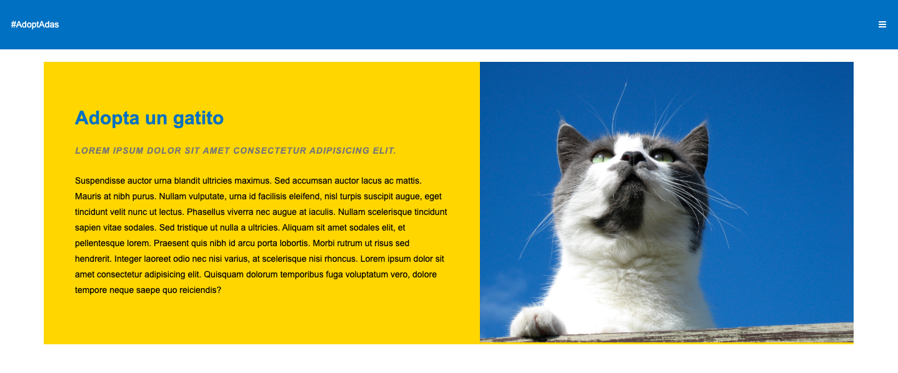

# Clase 64

## Maquetado y funcionalidad

- Hoy haremos una web de adopciones a partir de un diseño basico y un array de objetos que representan mascotas en adopcion. 

- El diseño puede ser el siguiente, o pueden hacer uno propio siempre y cuando la informacion sea la misma. 

- Las cards con gatos para adoptar deben tener la informacion de los objetos en main.js: name, shortDesc e img

- Al hacer clic en la card debe abrirse un modal que contenga la imagen mas grande, el nombre y longDesc 

- Al hacer hover sobre una card la imagen del gato debe agrandarse y los colores deben cambiar (la primera card en la imagen muestra el hover). No debe ocurrir de golpe sino con un transition. 

- No es necesaria ninguna accion al momento de cliquear en el icono de menu. 

- Los iconos deben ser de font awesome. 

- No esta permitido usar bootstrap. 

- los colores usados son 1a75bc y fed201, la imagen es https://www.flickr.com/photos/38203831@N00/168638725
